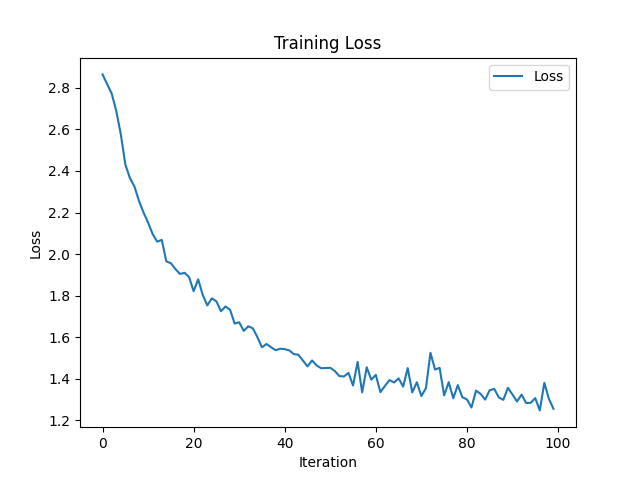

# Character-Level-RNN-Classification

Character Level RNN feeds the name character-by-character (individual letter) into the RNN and predicts the category of the name. In [model.py](./model.py), I've written two models: `RNN` model which is a somewhat scratch model and `T_RNN` model which uses PyTorch's built in RNN.


## Training

Here we have two models, which can be trained as

**a. Scratch RNN**
```python
python train.py
```

**b. PyTorch RNN**

```python
python train.py --model_type pytorch
```


## Evaluate

For evaluating both type of network, we can use following scripts.

**a. Scratch RNN**

```python
python evaluate.py --name Najjar
```
```Output: The name Najjar is: Arabic```

**b. PyTorch RNN**

```python
python evaluate.py --name Palmeiro --model_type pytorch
```
```Output: The name Palmeiro is: Portuguese```


## Results

The training results of the run for 100_000 iterations is shown below.

**a. Scratch RNN**


**b. PyTorch RNN**

