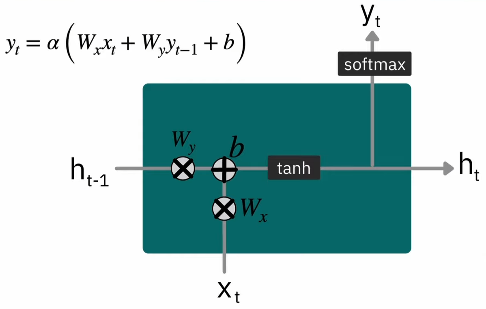
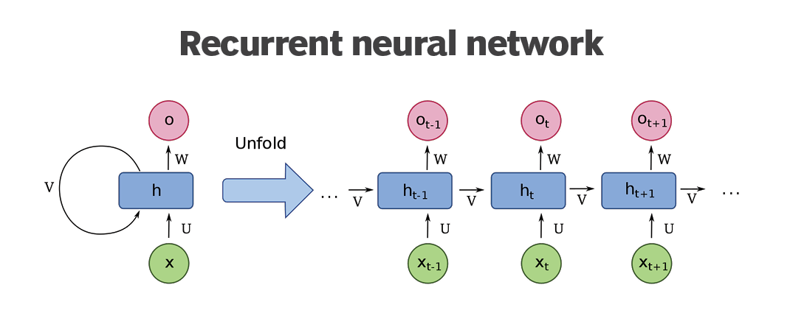
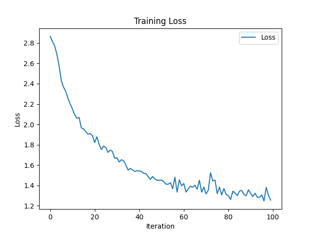
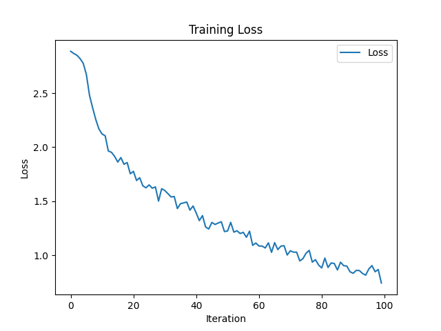
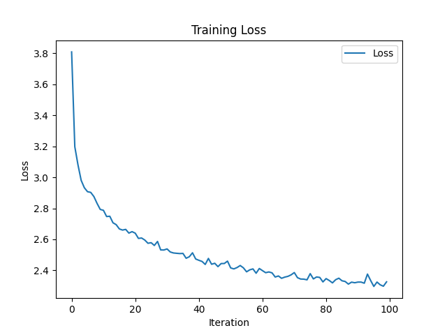

# Character-Level-RNN

Character Level RNN feeds the text character-by-character (individual letter) into the RNN. This project aims to accomplish following two things:

- [Classification](#classification)
- [Generation](#generation)

## Recurrent Neural Network

**a. RNN Cell**


**b. RNN**


## Classification

For classification, I've written [model_c.py](./model_c.py) where there are two models: `RNN` model which is a somewhat scratch model and `T_RNN` model which uses PyTorch's built in RNN.

### Training

Here we have two models, which can be trained as

**a. Scratch RNN**
```python
python train_c.py
```

**b. PyTorch RNN**

```python
python train_c.py --model_type pytorch
```

### Results

The training results of the run for 100_000 iterations is shown below.

**a. Scratch Classification RNN**


**b. PyTorch RNN**


### Evaluate

For evaluating both type of network, we can use following scripts.

**a. Scratch RNN**

```python
python evaluate.py --name Najjar
```
`Output: The name Najjar is: Arabic`

**b. PyTorch RNN**

```python
python evaluate.py --name Palmeiro --model_type pytorch
```
`Output: The name Palmeiro is: Portuguese`


## Generation

For classification, I've written [model_g.py](./model_g.py) which builts upon the RNN of classification.

### Training

The model can be trained by running script:

```python
python model_g.py
```

### Results

The training results of the run for 100_000 iterations is shown below.



### Generate

For generating the name, run following script.

```python
python generate.py --country Russian --start R
```
`Output: The generated Russian name is Rovakov`
